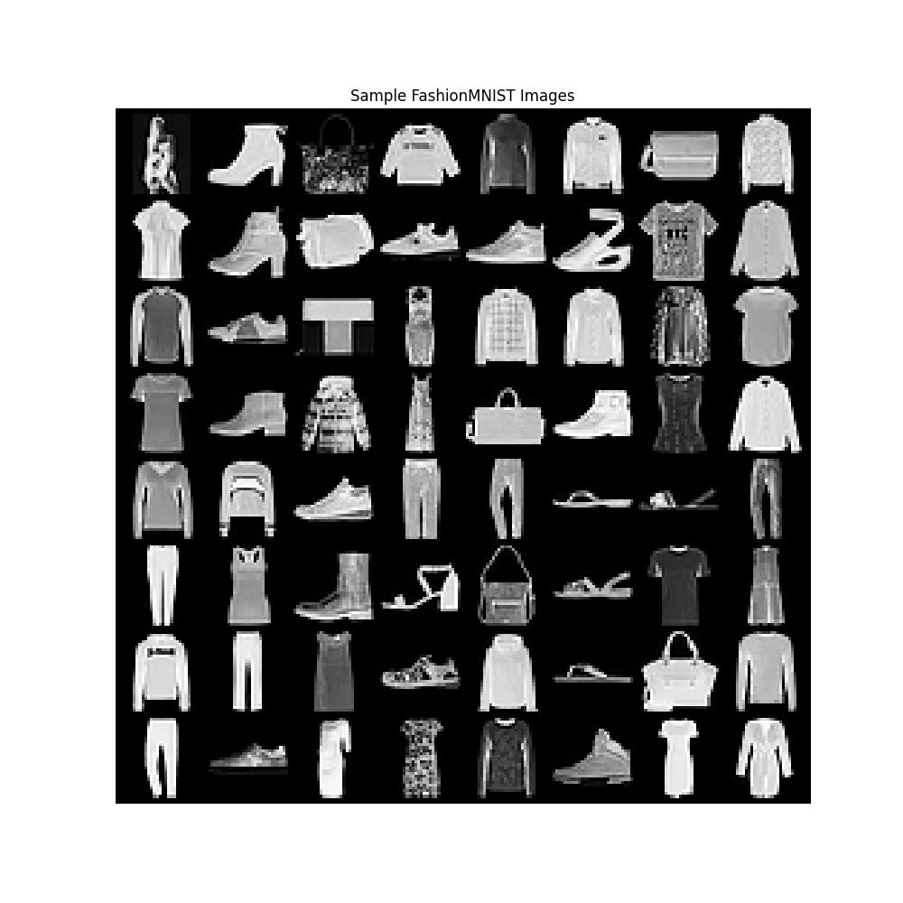
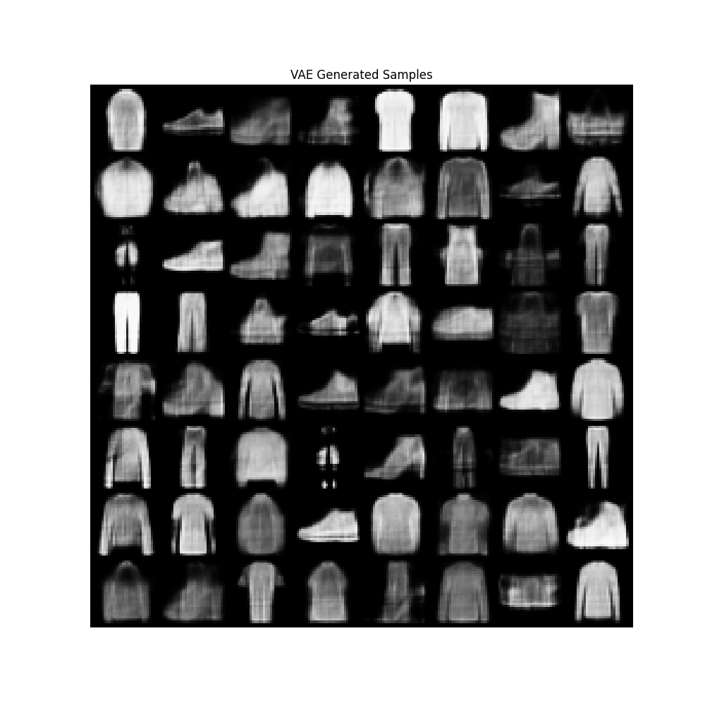
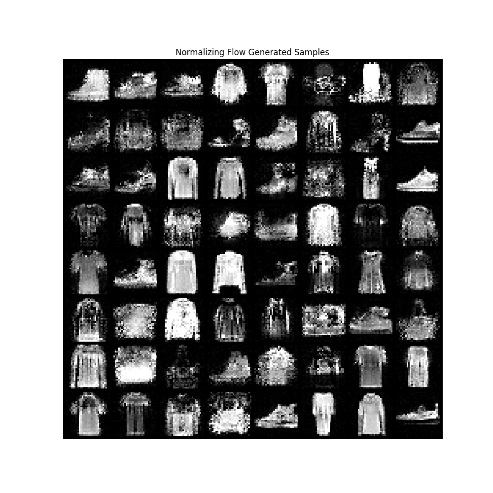
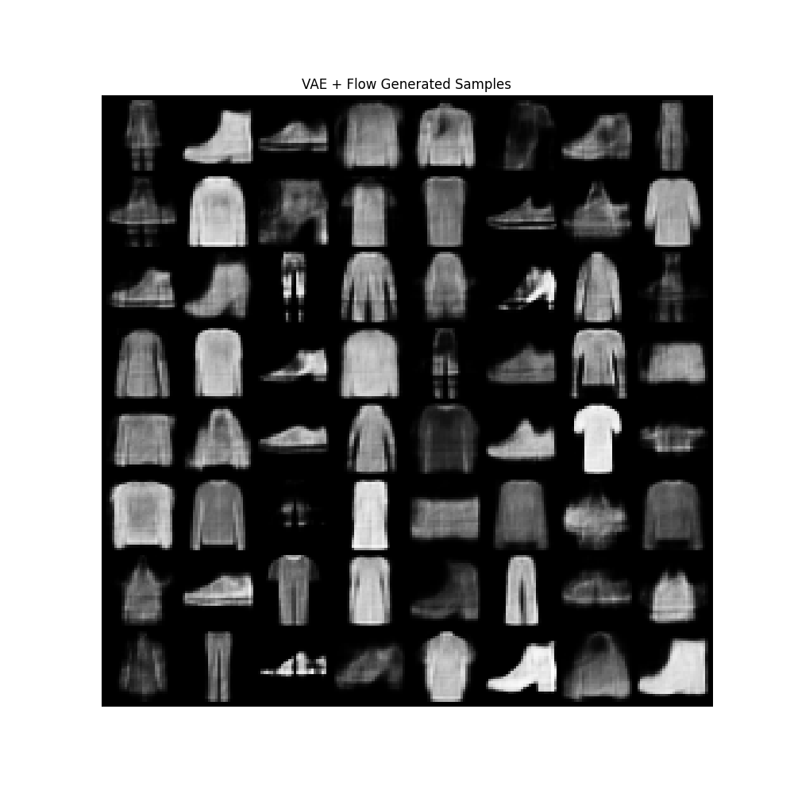

# VAE & Normalizing Flow for Fashion‑MNIST 🎨

This repository demonstrates two foundational likelihood-based generative models implemented in PyTorch:

- **Variational Autoencoder (VAE)** — encoder/decoder architecture with learned latent distribution  
- **Normalizing Flow (NF)** — invertible mapping modeling exact data likelihood using affine coupling layers

---

## 📂 Project Structure

```
.
├── data/               # Fashion‑MNIST dataset (auto‑downloaded)
├── models/             # VAE and NF model scripts
│   ├── vae.py          # VAE model & loss function
│   └── nrm_flow.py     # AffineCoupling + NormalizingFlowModel
├── scripts/            # Training scripts
│   ├── train_vae.py    # Train & sample with VAE
│   └── train_flow.py   # Train & sample with NF
├── outputs/            # Output sample images
├── Generative Models.ipynb  # 📓 Main interactive notebook
└── README.md           # This file
```

---

## ⚙️ Setup

1. Clone the repo:
   ```bash
   git clone https://github.com/AmeyChitnis/VAE_Normalizing_Flow_Generative.git
   cd VAE_Normalizing_Flow_Generative
   ```

2. (Optional) Create and activate a virtual environment:
   ```bash
   python3 -m venv .venv
   source .venv/bin/activate
   ```

3. Install dependencies:
   ```bash
   pip install torch torchvision matplotlib
   ```

---

## 🚀 Usage

### 🧪 Interactive (Notebook)
Open and run:
```
Generative Models.ipynb
```
This notebook uses the `models/` folder and walks through training, generating, and comparing both models.

### 🖥️ Scripts

#### VAE:
```bash
python scripts/train_vae.py
```
Generates `outputs/vae_generated_samples.png`

#### Normalizing Flow:
```bash
python scripts/train_flow.py
```
Generates `outputs/nf_generated_samples.png` and `outputs/fashionmnist_samples.png`

---

## 🖼️ Sample Comparison

| FashionMNIST Samples                 | VAE Generated                         | NF Generated                          | VAE + NF Generated                             |
|--------------------------------------|---------------------------------------|---------------------------------------|------------------------------------------------|
|  |  |  |  |

- **VAE**: captures global structure well, but images are smoother and blurrier.
- **NF (before fix)**: inconsistent and noisy due to latent mismatch or unbalanced flow design.
- **NF (after fix)**: sharper but still may require tuning (more flows, normalization, etc.)

---

## 💡 Insights

- **VAE**: Optimizes ELBO (approximate likelihood) — tends to average input patches  
- **NF**: Learns invertible transforms, enabling exact likelihood but requires capacity and normalization  
- **Tips**:
  - Use alternating coupling parity and normalization layers for NF
  - Experiment with learning rates, schedule, and longer training
  - Future work: Blend flows into VAE (e.g., Flow-VAE), or evaluate with FID

---

## 🛠️ Future Enhancements

- Add **ActNorm / BatchNorm** layers within NF  
- Train deeper or more expressive flows  
- Integrate evaluation metrics (FID, IS)  
- Explore **conditional generation** or **latent interpolations**

---

## 📝 License & Contact

Licensed under [MIT](LICENSE).  
Feel free to open issues or reach out if you'd like to collaborate!
